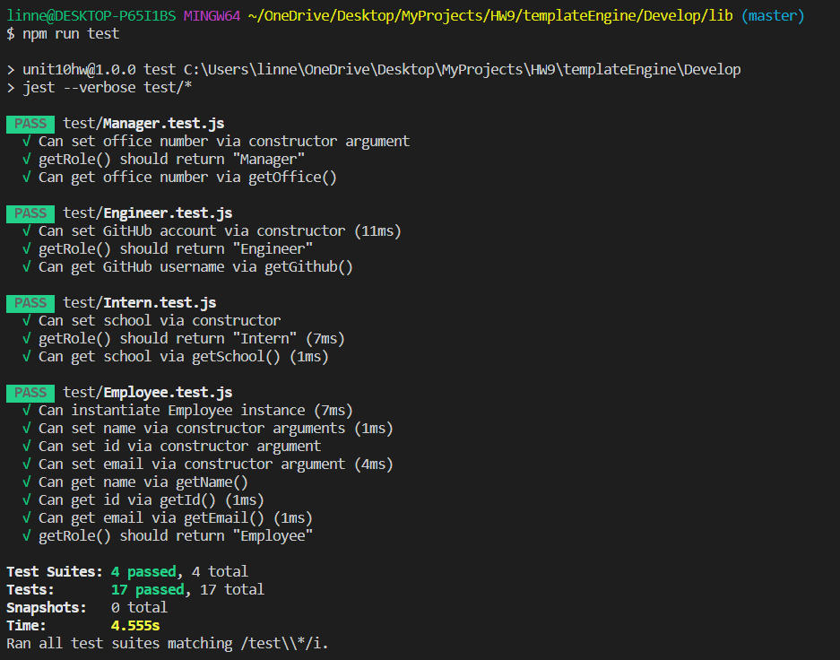

# Template Engine - Employee Summary

This application is a software engineering team generator command line application. The application will prompt the user for information about the team manager and then information about the team members. The user can input any number of team members, and they may be a mix of engineers and interns. When the user has completed building the team, the application will create an HTML file that displays a nicely formatted team roster based on the information provided by the user.

## User Story
```
As a manager
I want to generate a webpage that displays my team's basic info
so that I have quick access to emails and GitHub profiles
```

## Installation

First, run `npm install` to install all necessary dependencies.

This app runs as a Node CLI to gather information about each employee, so once installed, begin the application by running `node app.js`.

## Dependencies Used

- [jest](https://jestjs.io/) for running the provided tests
- [inquirer](https://www.npmjs.com/package/inquirer) for collecting input from the user

## Tests

This app has several test.js files, ensuring that all unit tests pass and the app is fully functional and working. 



## Video Example

[Click this link to see a video example of the working application](https://youtu.be/1m_SW-wQEZY)

Finished html file:
